# Homelab SOC Environment - Web Server & Security Monitoring Lab

## Project Overview

This project involves the complete setup and hardening of an Ubuntu Web server within a controlled SOC environment. The goal was to build a secure infrastructure for a WordPress site, implement a real-time intrusion monitoring system and test the system's resilience through simulated attacks.

---

# Lab Architecture

## Web Server Node
- **OS:** Ubuntu Server 22.04 LTS (VM)
- **Hypervisor:** VMware Workstation Pro
- **Stack:**
  - NGINX
  - PHP-FPM
  - MySQL
  - WordPress
- **Security Controls:**
  - UFW Firewall
  - Fail2Ban
  - SSH Hardening (Key-only auth, custom port, root disabled)
  - Wordfence (WAF)
- **Monitoring Agents:**
  - Wazuh Agent
  - Netdata Agent

---

## Monitoring & SIEM Node
- **OS:** Ubuntu Desktop 24.04 LTS
- **Services:**
  - Wazuh Manager
  - Wazuh Indexer
  - Wazuh Dashboard
  - Netdata Central Dashboard

---

## Red Team VM
- **OS:** Kali Linux
- **Purpose:** Controlled attack simulation & validation testing

---

# 1. System Setup & Hardening

First, I fully updated the system to make sure all security patches were in place before installing anything else.

---

```bash
sudo apt update && sudo apt upgrade -y
```

---

## 1.2 Create Non-Root User

To follow security best practices and reduce reliance on the root account, I created a new administrative user and added them to the sudo group.

```bash
sudo adduser developer
sudo usermod -aG sudo developer
```

---

## 1.3 Install NGINX

I installed NGINX to serve the WordPress application. After the installation, I enabled the service to start automatically at boot and verified its status to confirm everything was running correctly.

```bash
sudo apt install nginx -y
sudo systemctl start nginx
sudo systemctl enable nginx
sudo systemctl status nginx
```

---

# 2. SSH Hardening

During the initial phase, I temporarily left SSH password authentication enabled. This allowed me to observe automated brute-force attempts in the logs, which I later used for detection testing.

Once I finished the observation phase, I hardened the SSH configuration with the following steps:
1.	Disabled Root Login: To reduce the attack surface.
2.	Enforced Key-Based Authentication: I disabled passwords entirely in favor of SSH keys.
3.	Changed the Default Port: I moved SSH to port 2222 to filter out the "noise" of automated scanners.

```bash
sudo nano /etc/ssh/sshd_config
```
Modify:
```
PermitRootLogin no
PasswordAuthentication no
Port 2222
```

Restart SSH:
```bash
sudo systemctl restart ssh
```

---

## 2.1 SSH Key-Based Authentication

I generated a 4096-bit RSA key pair and added a passphrase for an extra layer of protection. After copying the public key to the server, I verified that access now requires both the physical private key and the passphrase.

```bash
ssh-keygen -t rsa -b 4096 -f ~/.ssh/id_rsa
```

---

## 2.2 Configure UFW Firewall

I used UFW (Uncomplicated Firewall) to restrict network access. I specifically allowed:
```bash
sudo ufw allow 2222/tcp
sudo ufw allow 'Nginx Full'
sudo ufw enable
sudo ufw status verbose
```
Firewall rules were verified to confirm correct configuration:
```bash
sudo ufw status verbose
```
---

# 3. Web & Database Security

---

## 3.1 NGINX Hardening for WordPress

To mitigate common WordPress-specific attacks, I modified the NGINX configuration to explicitly block access to `xmlrpc.php`, which is a frequent target for brute-force and amplification attacks.

Add the following rule inside the server block:

```nginx
location = /xmlrpc.php {
    deny all;
}
```

This rule operates alongside the standard PHP handling configuration:

```nginx
location ~ \.php$ {
    include snippets/fastcgi-php.conf;
    fastcgi_pass unix:/var/run/php/php8.3-fpm.sock;
}
```

After configuring the virtual host, the site was enabled and the configuration was tested:

```bash
sudo ln -s /etc/nginx/sites-available/castellum.local /etc/nginx/sites-enabled/
sudo nginx -t
sudo systemctl reload nginx
```

This configuration prevents abuse of the XML-RPC endpoint while preserving proper PHP processing through PHP-FPM.

---

## 3.2 Create WordPress Database

MySQL was installed to serve as the database backend for WordPress.

```sql
sudo apt install mysql-server -y
```

I executed the MySQL secure installation script to eliminate insecure default settings and strengthen the overall database security posture.

```bash
sudo mysql_secure_installation
```

This script was used to:

- Remove anonymous user accounts  
- Disable remote root login  
- Delete the default test database  
- Enforce a strong password for the root account

## Database and User Configuration

Logged into the database server:

```bash
sudo mysql -u root -p
```

I applied the [Principle of Least Privilege](https://en.wikipedia.org/wiki/Principle_of_least_privilege/) by creating a dedicated database user for WordPress. This user only has permissions for the specific WordPress database, significantly limiting the impact if the application is ever compromised.

```sql
CREATE DATABASE wordpress DEFAULT CHARACTER SET utf8 COLLATE utf8_unicode_ci;

CREATE USER 'castle25'@'localhost' IDENTIFIED BY 'Strongp@ssword!';

GRANT SELECT, INSERT, UPDATE, DELETE, CREATE, DROP, ALTER 
ON wordpress.* 
TO 'castle25'@'localhost';

FLUSH PRIVILEGES;
EXIT;
```

---

# 4. Application Installation & Optimization

## 4.1. Install PHP & Dependencies

I implemented [PHP-FPM](https://www.php.net/manual/en/install.fpm.php) to handle PHP processing efficiently through NGINX. After installing the necessary extensions, I verified the version and enabled the service.

```bash
sudo apt install php-fpm php-mysql php-curl php-gd php-xml \
php-mbstring php-xmlrpc php-soap php-intl php-zip -y

php -v

sudo systemctl enable php8.3-fpm
sudo systemctl start php8.3-fpm
```

---

## 4.2 Download & Configure WordPress

I downloaded the official WordPress package and set proper ownership and permissions to ensure NGINX can serve the files securely while limiting unnecessary write access.

```bash
cd /tmp
wget https://wordpress.org/latest.tar.gz
tar -xvzf latest.tar.gz
sudo cp -r wordpress/* /var/www/castellum/
```
Set permissions:

```bash
sudo chown -R www-data:www-data /var/www/castellum
sudo find /var/www/castellum -type d -exec chmod 755 {} \;
sudo find /var/www/castellum -type f -exec chmod 644 {} \;
```
The WordPress configuration file was created and edited to match the database credentials previously configured in MySQL.

```bash
cp wp-config-sample.php wp-config.php
nano wp-config.php
```

```
define('DB_NAME', 'wordpress');
define('DB_USER', 'castle25');
define('DB_PASSWORD', 'strongpassword');
define('DB_HOST', 'localhost');
```
This configuration allows WordPress to securely connect to the correct database using a dedicated database user.
Once the site was initialized through the web installer, an administrator account was created using a strong, unique password.

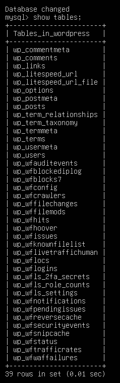

---

# 5. Monitoring & Detection Tools

## 5.1. Fail2Ban

I installed Fail2Ban to protect against SSH brute-force attacks, then I configured a custom "jail" that automatically bans an IP address for one hour if it fails to log in three times within a 10-minute window.

```bash
sudo apt update
sudo apt install fail2ban -y

#A local configuration file was created to avoid modifying the default configuration.
sudo cp /etc/fail2ban/jail.conf /etc/fail2ban/jail.local
sudo nano /etc/fail2ban/jail.local
```

## 5.2. SSH Jail Configuration

The following settings were applied in the sshd section:

```bash
sudo nano /etc/ssh/sshd_config
```

```bash
[sshd]
enabled = true
port = 2222
filter = sshd
logpath = /var/log/auth.log
maxretry = 3
findtime = 10m
bantime = 1h
```
This configuration enforces the following behavior:
- An IP address is banned after 3 failed login attempts
- The attempts must occur within 10 minutes
- The ban duration is 1 hour

The service status and active jail were verified:
```bash
sudo systemctl restart fail2ban
sudo fail2ban-client status sshd
```
The server is automatically protected against repeated unauthorized SSH login attempts and relevant events are available for monitoring and alerting within the SOC environment.
---

## 5.3. WordPress Application Security (Wordfence)

The hosted WordPress site serves as a live target within the homelab to monitor application-layer traffic and test security defenses. To protect this environment, I installed and configured the Wordfence security plugin, which defends against brute-force login attempts, malicious bots and attack patterns targeting WordPress.

My hardening process involved enabling the Web Application Firewall (WAF) and setting up strict brute-force protection. Based on my configuration, the system locks out users after 5 login failures and immediately blocks anyone attempting to sign in with unauthorized usernames like "admin" or "administrator". Additionally, I enabled Rate Limiting to throttle any IP exceeding 120 requests per minute to prevent automated scanning. Finally, I implemented the WPS Hide Login plugin to change the default login URL, adding a layer of security through obscurity that effectively hides the login page from automated bots and unauthorized users.


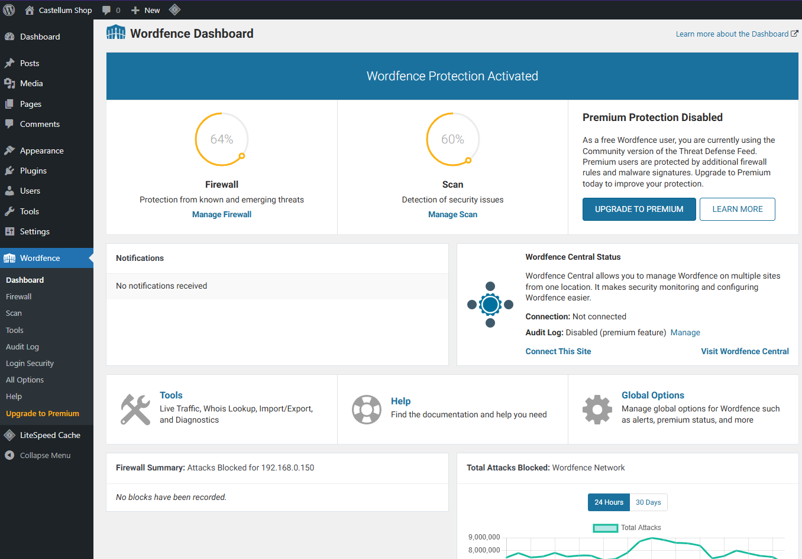
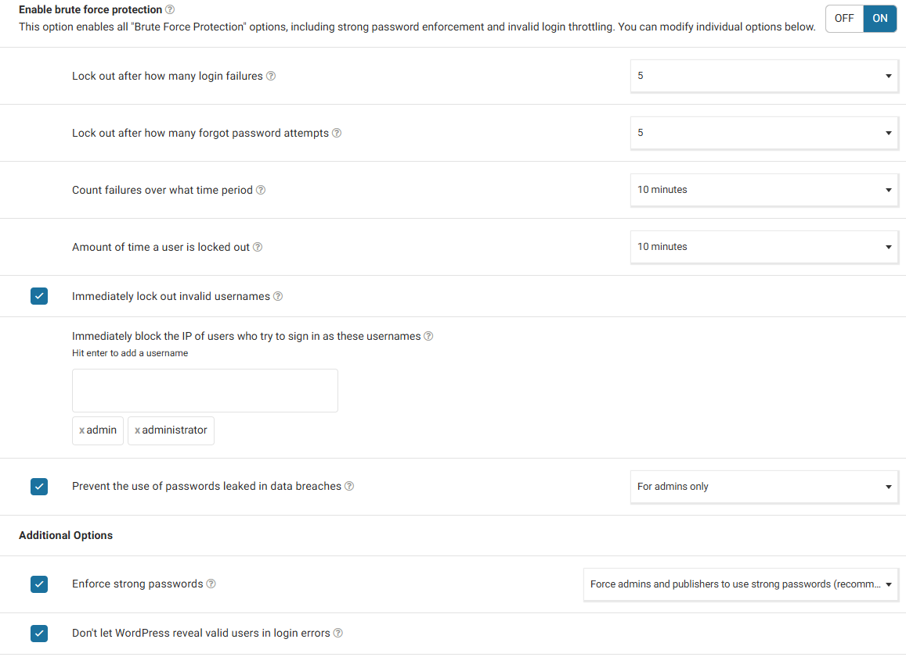
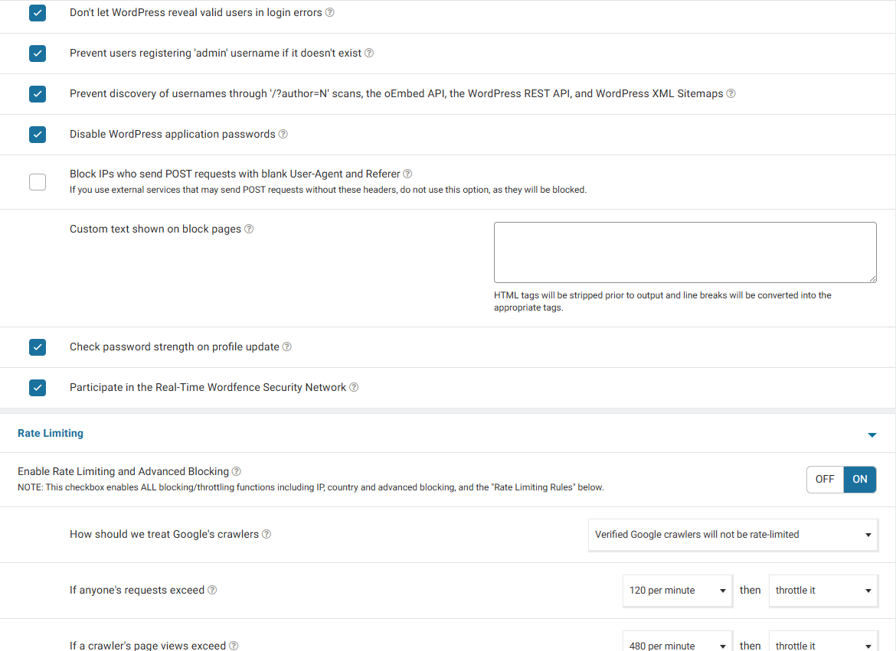
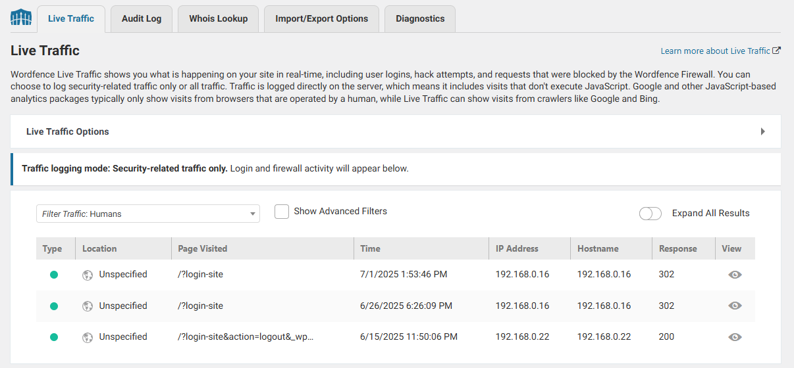
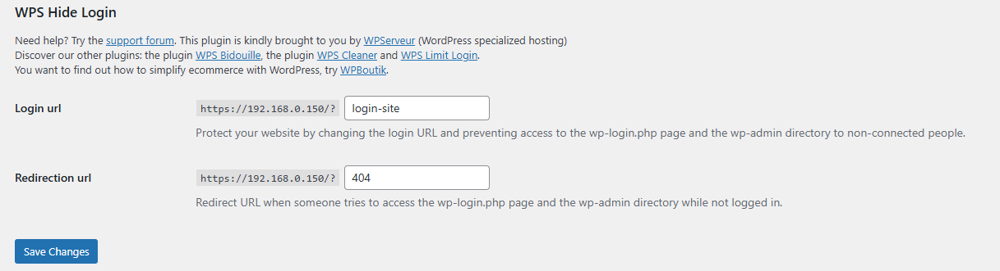
---

# 5.4. Netdata

I deployed Netdata for real-time performance monitoring. Through its dashboard, I can monitor CPU spikes, memory usage and network traffic, which helps me identify anomalies that might indicate a DDoS attack or a breach
The installation was performed using the official Netdata one-line installation script with telemetry disabled:

```bash
wget -O /tmp/netdata-kickstart.sh https://get.netdata.cloud/kickstart.sh
sh /tmp/netdata-kickstart.sh --disable-telemetry
```
[Installation Netdata](https://learn.netdata.cloud/docs/netdata-agent/installation/linux/)

After installation, the Netdata dashboard became accessible via a web browser at:
```bash
http://<server-ip>:19999
```
Activating Netdata
```bash
sudo systemctl status netdata    
sudo systemctl restart netdata   
sudo systemctl enable netdata
```
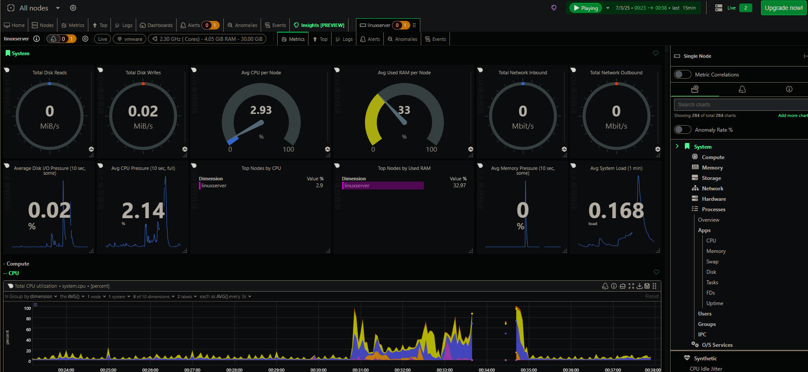

---

## 5.5. Wazuh SIEM

Wazuh was installed on the Ubuntu laptop designated as the Monitoring and SIEM node. The installation followed the official Wazuh quickstart guide and was completed using the all-in-one installation script, which deploys the Wazuh Manager, Indexer and Dashboard.

[Installation Wazuh](https://documentation.wazuh.com/current/quickstart.html)

This setup enables centralized security monitoring, including:
- Log collection and analysis
- Intrusion detection
- File integrity monitoring
- Alert generation and visualization

Security events from monitored systems can be correlated and analyzed within a single dashboard.

Wazuh agents can be installed on each monitored device such as the Ubuntu web server and other hosts in the lab environment to forward logs and security events to the Wazuh Manager.

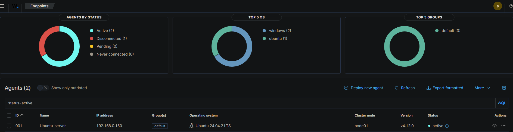

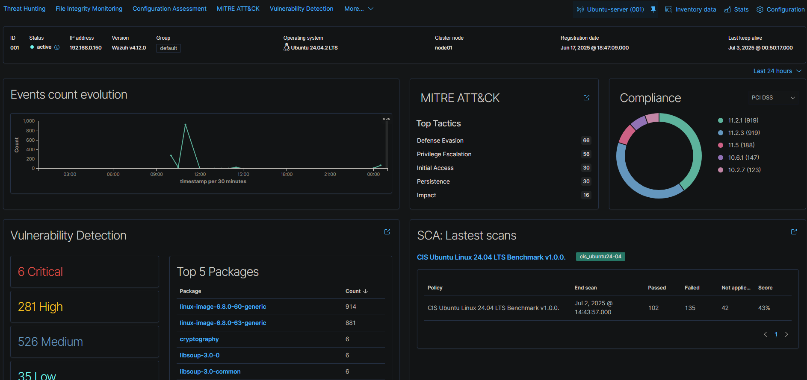

---

# 6. Penetration Testing & Validation (Red Team Phase)

After securing the server, I used a Kali Linux VM to perform controlled testing. My goal was to verify that my monitoring tools (Wazuh, Netdata, and Fail2Ban) were catching the "attacks."

## 6.1. Reconnaissance Detection and Vulnerability Scanning

The testing process began with Nmap tool first to identify open ports and exposed services on the Ubuntu server.

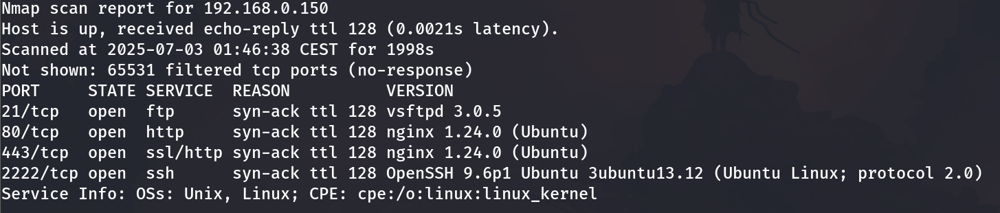

During the scan, Netdata showed a clear spike in network traffic, CPU and network utilization were increased during the scan window.

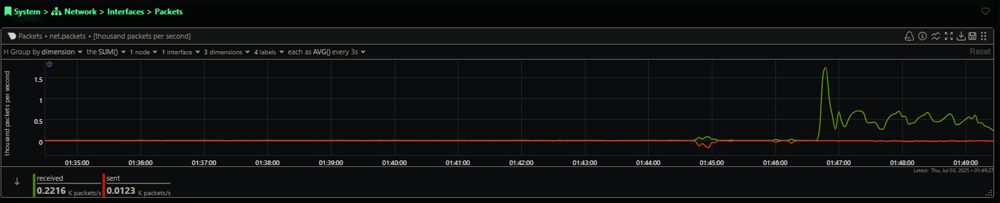

I followed the initial discovery with a more aggressive vulnerability scan using the --script vuln command. This aimed to identify common service weaknesses and configuration flaws.

This phase successfully triggered several Wazuh alerts, as the SIEM identified patterns consistent with automated scanning. Upon reviewing the logs, I found a surge in NGINX error messages and repeated authentication attempts, proving that the server was not only logging the malicious intent but also correlating the events into actionable security alerts.

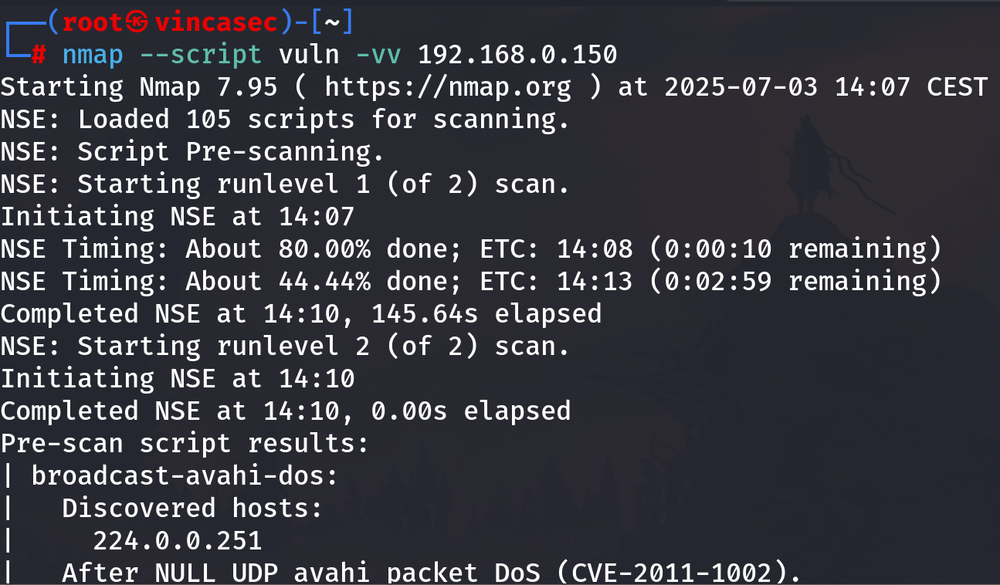

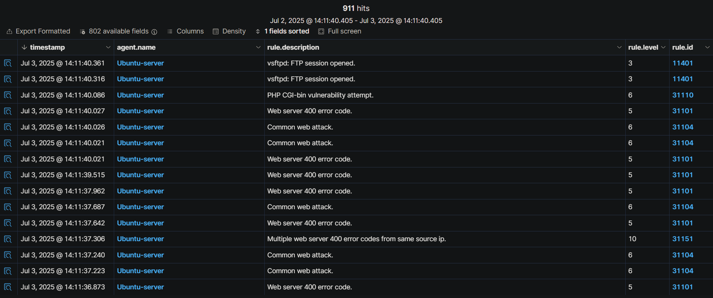

---

## 6.2. SSH Brute-Force Attempt and Automated Response

I conducted a controlled SSH brute-force attempt to test my authentication defenses and automated response mechanisms. Wazuh immediately detected the repeated failed login attempts and generated high-priority security alerts, while Fail2Ban responded by automatically blocking the attacking IP address after the third failed attempt. I confirmed the active ban using Fail2Ban status checks, which proved that the automated defensive policy was working as intended.

After attack phase, I fully disabled SSH password authentication and enforced key-based access. By requiring a private key, the server automatically blocks all password-based brute-force attempts, making it much harder for unauthorized users to get in.

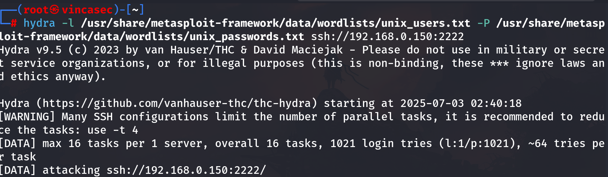

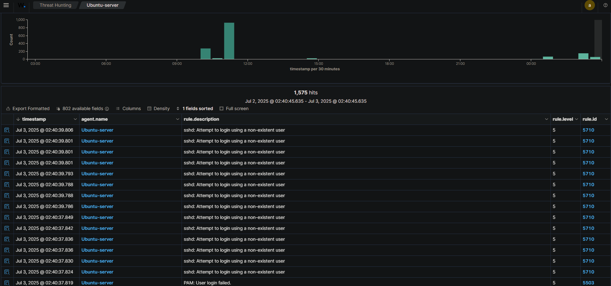

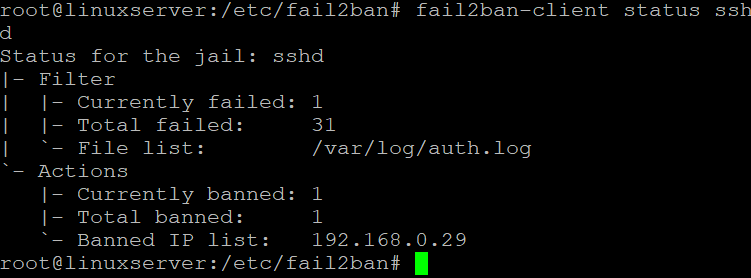
---

## 6.3 Malware Detection (VirusTotal Integration)

Based on the Wazuh documentation, I set up integration between Wazuh and VirusTotal to enhance malware detection capabilities. I configured Wazuh to automatically check newly detected files against VirusTotal’s database to identify potentially malicious files.

[Wazuh VirusTotal](https://documentation.wazuh.com/current/proof-of-concept-guide/detect-remove-malware-virustotal.html)

[Wazuh VirusTotal](https://documentation.wazuh.com/current/user-manual/capabilities/malware-detection/virus-total-integration.html)

I tested the Wazuh-VirusTotal integration by placing several known malicious test files in the root and home directories. Wazuh’s File Integrity Monitoring (FIM) module instantly detected the new files and triggered an automated check against the VirusTotal database. Once the system confirmed the files were malicious, an automated response script was executed immediately to remove them from the server. Automating the malware detection and remediation workflow in this way effectively reduces the need for manual intervention and significantly improves overall system security.

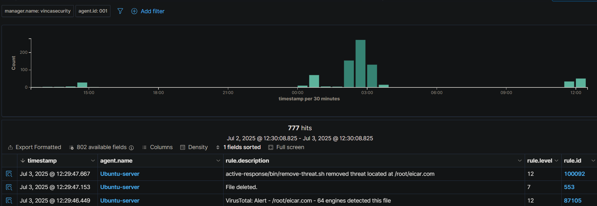


## 6.4. SQL Injection and WPScan

I used tool SQLMap to test the WordPress site for vulnerabilities. Wazuh detected the suspicious patterns in the NGINX logs, while the Wordfence plugin on the site blocked my Kali IP address after detecting wpscan in the User-Agent request.

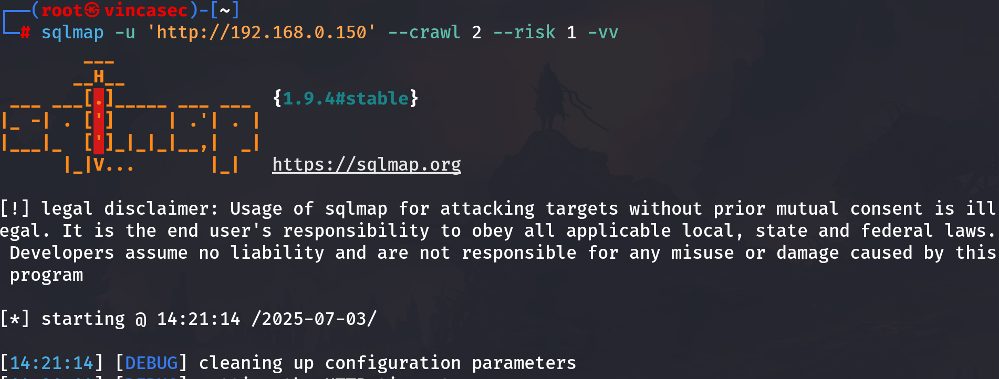

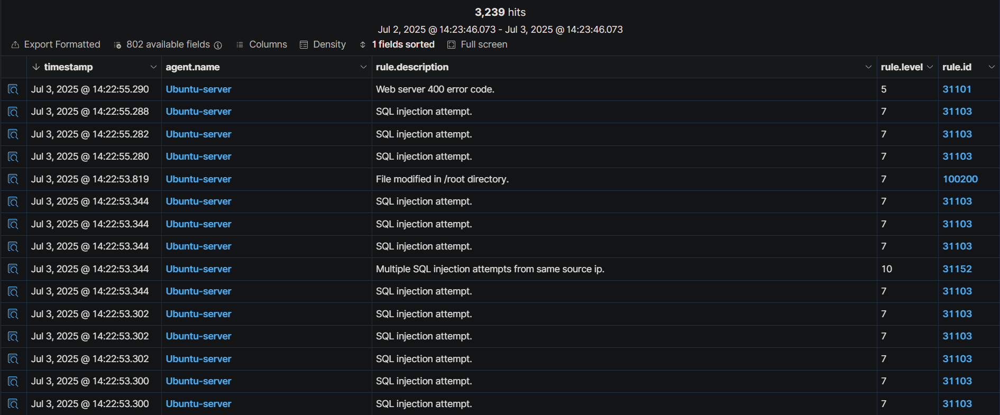

I wanted to see how the application-level security would hold up, so I threw a few WPScan attacks at the Wordfence plugin. I used the tool to run some standard reconnaissance, hunting for things like outdated plugins and known WordPress exploits. Wordfence’s WAF flagged the scanning patterns almost immediately and automatically blacklisted my Kali IP for the aggressive activity.

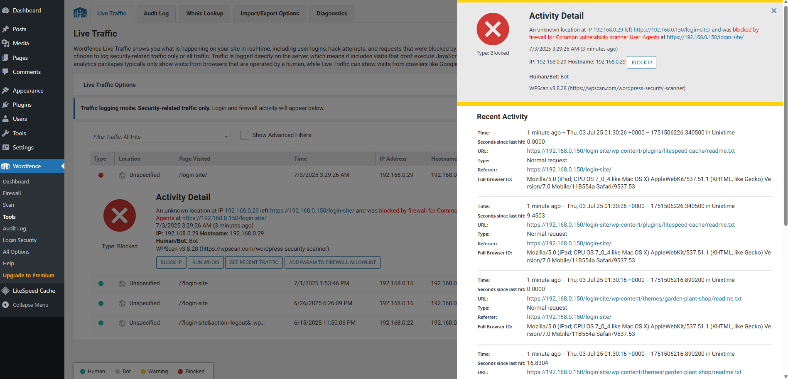

---

## 6.5 Security Configuration Assessment (SCA)

The Ubuntu server was completely audited against industry security standards by the Wazuh Configuration Assessment (SCA) module. The scan identified specific vulnerabilities and misconfigurations that required attention by examining installed packages, active policies, and system settings. The process of strengthening service configurations and greatly enhancing the overall baseline hardening was greatly aided by these extremely valuable insights. Even the smaller security flaws, which are frequently disregarded, were successfully closed by adhering to these suggestions.

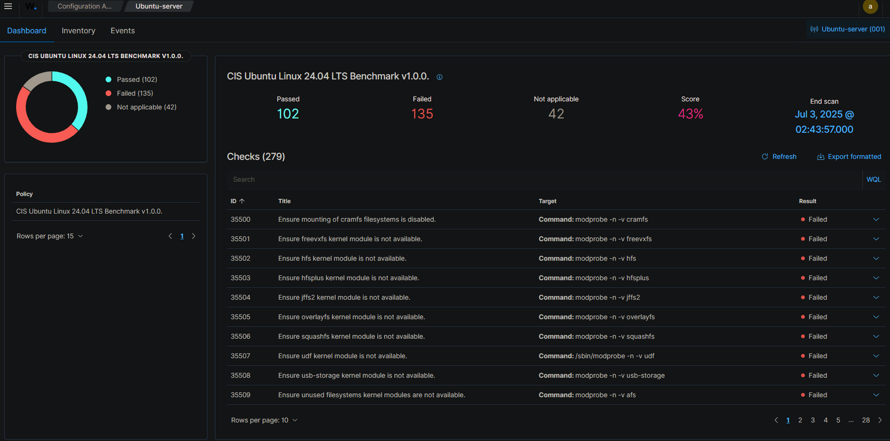
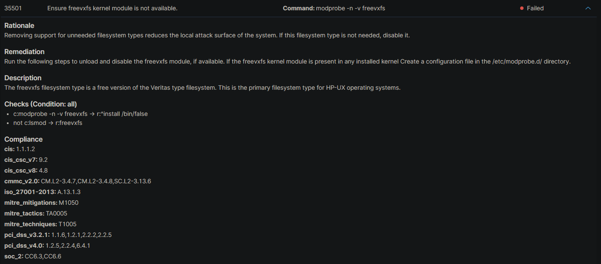
---

# 7. Conclusion

Building this setup really showed me how powerful layered security can be when you combine system hardening with real-time monitoring. By integrating tools like Wazuh and Fail2Ban, I was able to automate the defense process so the server identifies and shuts down threats without any manual intervention. Testing the environment with Kali Linux confirmed that most common attacks are easily stopped with the right configuration and a proactive approach to monitoring.
